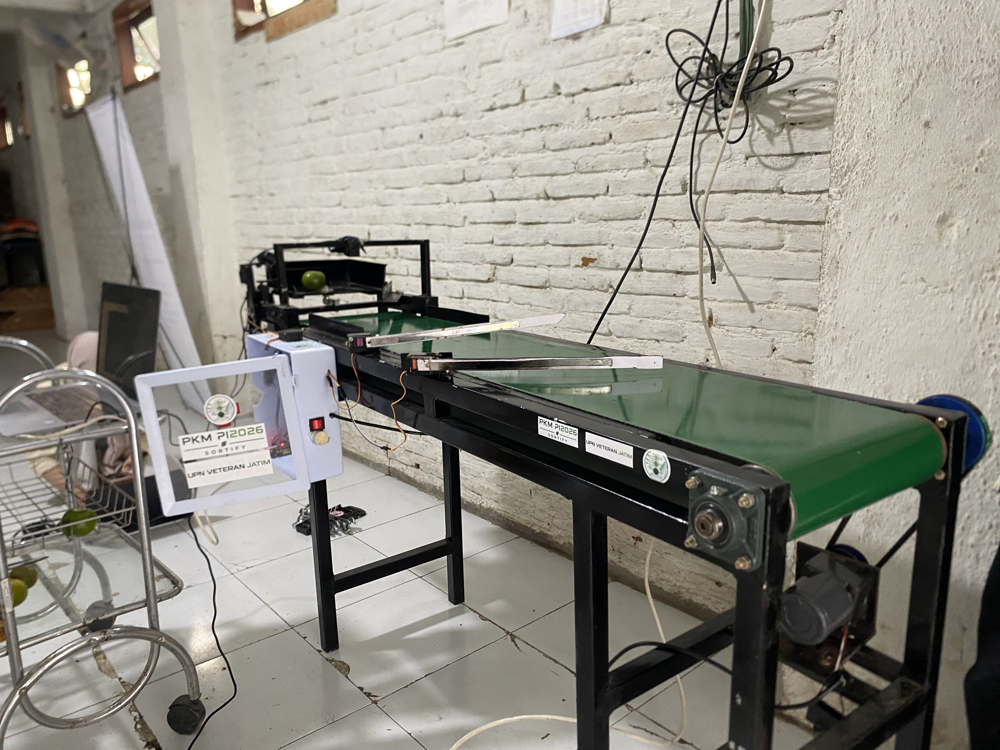

# 🍎 Sistem Sortir Otomatis Multi-Buah Organik Berdasarkan Grade Menggunakan IoT dan Machine Learning

> Sistem sortir buah otomatis berbasis **ESP32**, **Computer Vision (Deep Learning)**, dan **Cloud API**, yang mampu mengklasifikasikan kualitas buah (Grade A/B) secara *real-time* langsung di atas jalur conveyor, lalu mencatat setiap hasil sortir ke **Google Spreadsheet** secara otomatis.


---

## 📑 Daftar Isi

1. [Pendahuluan](#-1-pendahuluan)
2. [Rumusan Masalah](#-2-rumusan-masalah)
3. [Tujuan Sistem](#-3-tujuan-sistem)
4. [Arsitektur Sistem](#-4-arsitektur-sistem)
5. [Fitur-Fitur Sistem](#-5-fitur-fitur-sistem)
6. [Alur Kerja Sistem (Cara Kerja)](#-6-alur-kerja-sistem-cara-kerja)
7. [Struktur Proyek](#-7-struktur-proyek)
8. [Kebutuhan Perangkat Keras & Perangkat Lunak](#-8-kebutuhan-perangkat-keras--perangkat-lunak)
9. [Cara Instalasi & Konfigurasi](#-9-cara-instalasi--konfigurasi)
10. [Dokumentasi Visual](#-10-dokumentasi-visual)
11. [Mitra & Dampak di Lapangan](#-11-mitra--dampak-di-lapangan)
12. [Kekurangan & Keterbatasan Sistem Saat Ini](#-12-kekurangan--keterbatasan-sistem-saat-ini)
13. [Rencana Pengembangan Selanjutnya](#-13-rencana-pengembangan-selanjutnya)
14. [Kontributor](#-14-kontributor)

---

## 📖 1. Pendahuluan

Proses sortir buah secara manual di tingkat petani maupun UMKM pengepakan buah umumnya masih dilakukan dengan cara visual oleh manusia. Cara ini memiliki beberapa kelemahan mendasar: **subjektif** (standar "bagus" dan "jelek" berbeda-beda antar pekerja), **lambat**, **tidak konsisten** dalam jangka waktu lama akibat kelelahan, dan **sulit didokumentasikan** untuk keperluan pelaporan maupun analisis kualitas hasil panen.

Sistem ini hadir sebagai solusi atas permasalahan tersebut. Proyek ini menggabungkan tiga bidang teknologi sekaligus:

- **Internet of Things (IoT)** — menggunakan mikrokontroler ESP32 sebagai otak sistem mekanik (timbangan, servo penyortir, layar informasi).
- **Machine Learning / Computer Vision** — menggunakan model *deep learning* (CNN) untuk mengenali jenis buah sekaligus kualitasnya hanya dari citra kamera.
- **Cloud Computing & Otomasi Dokumen** — proses klasifikasi berat dijalankan di *cloud* (bukan di perangkat kecil), dan setiap hasil sortir otomatis tercatat rapi ke Google Spreadsheet tanpa campur tangan manusia.

Sistem ini dirancang agar dapat men-*scale* untuk berbagai jenis buah (saat ini: **apel** dan **jeruk**), dengan proses penambahan buah baru yang cukup dilakukan lewat pelatihan ulang model, tanpa mengubah firmware maupun mekanik conveyor.

---

## ❓ 2. Rumusan Masalah

1. Bagaimana merancang sistem yang mampu mendeteksi kedatangan buah pada conveyor secara otomatis tanpa sensor yang rumit dan mahal?
2. Bagaimana mengklasifikasikan kualitas (grade) buah secara objektif dan konsisten menggunakan citra kamera?
3. Bagaimana mengarahkan buah secara fisik ke jalur yang berbeda (bagus/jelek/gagal) berdasarkan hasil klasifikasi tersebut secara *real-time*?
4. Bagaimana mendokumentasikan setiap hasil sortir secara otomatis agar dapat dipantau dan dianalisis tanpa pencatatan manual?
5. Bagaimana memastikan sistem tetap dapat diperbarui (*update* firmware) dari jarak jauh setelah dipasang di lokasi mitra, tanpa perlu membongkar ulang perangkat?

---

## 🎯 3. Tujuan Sistem

- Membangun prototipe conveyor sortir buah otomatis berbasis berat sebagai pemicu (*trigger*) deteksi.
- Mengimplementasikan model *Convolutional Neural Network* (CNN) untuk klasifikasi multi-buah dan multi-grade (A = Bagus, B = Jelek).
- Membangun arsitektur *Cloud API* agar proses inferensi ML tidak membebani mikrokontroler kecil (ESP32).
- Mengintegrasikan sistem dengan Google Spreadsheet sebagai media pelaporan otomatis dan *real-time*.
- Menyediakan mekanisme **OTA (Over-The-Air) Update** agar firmware ESP32 dapat diperbarui dari jarak jauh melalui GitHub.

---

## 🏗️ 4. Arsitektur Sistem

Sistem ini terdiri dari empat lapisan (*layer*) utama yang saling terhubung melalui jaringan WiFi/internet:

```
┌──────────────────┐        ┌────────────────────┐        ┌──────────────────────┐        ┌───────────────────────┐
│   1. PERANGKAT     │        │  2. CAMERA BRIDGE    │        │   3. CLOUD ML API      │        │  4. GOOGLE SPREADSHEET │
│      KERAS         │  HTTP  │      SERVER          │  HTTP  │      (FastAPI)         │  HTTP  │     (Apps Script)      │
│  (ESP32 MAIN)       │◄──────►│  (camera_bridge_     │◄──────►│  Deployed di Render   │◄──────►│  Logging hasil sortir  │
│                     │        │   server.py)         │        │                        │        │                        │
│  • Load Cell (HX711)│        │  • Ambil foto 2 sisi │        │  • Model CNN Keras    │        │  • 1 baris / grading   │
│  • Servo x3         │        │  • Kirim ke Cloud ML │        │  • Klasifikasi buah + │        │  • Timestamp otomatis  │
│  • OLED Display     │        │  • Hitung grade akhir│        │    grade + confidence │        │                        │
│  • Buzzer           │        │  • mDNS (camtop/     │        │                        │        │                        │
│  • OTA Updater      │        │    camside.local)    │        │                        │        │                        │
└──────────────────┘        └────────────────────┘        └──────────────────────┘        └───────────────────────┘
```

**Ringkasan alur data:**
`Buah diletakkan → HX711 deteksi berat stabil → ESP32 minta 2 kamera (atas & samping) capture → Laptop (Camera Bridge) kirim foto ke Cloud ML API → Cloud API balas hasil klasifikasi (buah + grade + confidence) → Bridge hitung grade akhir (grade terjelek dari 2 sisi) → Bridge kirim grade final ke ESP32 → ESP32 gerakkan servo sortir sesuai grade → Bridge kirim log ke Google Sheet`

> 💡 **Kenapa ML tidak dijalankan langsung di ESP32-CAM?** Pada awalnya sistem dirancang on-device di ESP32-CAM, namun karena keterbatasan performa dan kualitas gambar, arsitektur dialihkan menjadi **hybrid**: dua *webcam* USB biasa yang disambungkan ke satu laptop, dengan laptop tersebut berperan sebagai *bridge* antara ESP32 dan Cloud ML API. Pendekatan ini terbukti jauh lebih stabil dan akurat.

---

## ✨ 5. Fitur-Fitur Sistem

### 🔩 A. Sisi Perangkat Keras & Firmware (`esp32_main.ino`)
- ✅ **Deteksi Otomatis Berbasis Berat** — menggunakan sensor *load cell* (HX711) sebagai pemicu, bukan sensor IR, untuk mendeteksi kedatangan buah secara presisi.
- ✅ **Deteksi Stabilitas Berat** — sistem menunggu pembacaan berat stabil (toleransi fluktuasi kecil selama beberapa detik) sebelum memicu proses capture, menghindari salah baca akibat guncangan.
- ✅ **Kalibrasi & Tare Load Cell** — dapat dikalibrasi ulang dan di-*tare* langsung dari menu serial monitor.
- ✅ **Tiga Servo Mekanik Independen:**
  - **Servo Dorong (Push)** — mendorong buah dari timbangan ke jalur conveyor.
  - **Servo Sortir 1 & Servo Sortir 2** — dua gerbang mekanik yang membuka/menutup sesuai grade untuk mengarahkan buah ke jalur Bagus / Jelek / Reject.
  - Setiap servo dapat dikonfigurasi arah putarnya sendiri (*reversed*) tanpa memengaruhi servo lain, mengakomodasi pemasangan fisik yang berbeda-beda.
- ✅ **Kalibrasi Waktu Tempuh Belt** — waktu aktivasi tiap gerbang servo disesuaikan dengan jarak fisik dari titik dorong, sehingga sinkron dengan kecepatan conveyor yang berjalan kontinu.
- ✅ **Layar OLED Informatif** — menampilkan status sistem (idle, menimbang, memproses, hasil grading) secara *real-time*.
- ✅ **Indikator Buzzer** — memberi umpan balik suara pada tahap-tahap proses (penimbangan, hasil, dsb).
- ✅ **WiFi Manager (Tanpa Hardcode SSID/Password)** — saat pertama kali dinyalakan atau WiFi gagal konek, ESP32 otomatis membuka Access Point konfigurasi sendiri sehingga mudah dipasang di lokasi mitra mana pun.
- ✅ **Auto-Reconnect WiFi** — memantau koneksi WiFi secara berkala dan otomatis menyambung ulang jika terputus.
- ✅ **OTA (Over-The-Air) Firmware Update** — ESP32 secara berkala mengecek versi firmware terbaru dari repositori GitHub dan meng-update dirinya sendiri secara otomatis tanpa perlu dibongkar/dicolok ke laptop, bekerja di jaringan WiFi mana pun.
- ✅ **Mode Manual via Serial Monitor** — tersedia menu interaktif untuk pengujian tiap komponen secara terpisah (uji servo, uji berat, uji kamera, uji OTA, dsb) — sangat membantu untuk debugging di lapangan.
- ✅ **Endpoint HTTP Internal** (`/status`, `/capture`, `/trigger`, `/classify`, `/ota/check`, `/ota/status`) untuk komunikasi dengan Camera Bridge Server dan pemantauan status sistem.

### 🎥 B. Sisi Camera Bridge Server (`camera_bridge_server.py`)
- ✅ **Dua Kamera dari Satu Laptop** — mendukung dua *webcam* USB biasa (murah, mudah didapat) yang menggantikan modul ESP32-CAM, masing-masing merepresentasikan sudut pandang **Atas** dan **Samping**.
- ✅ **Auto-Deteksi Kamera Berdasarkan Nama Perangkat** — sistem mengenali kamera lewat nama device (bukan cuma index), sehingga tidak tertukar meski urutan USB berubah, dengan mekanisme *fallback* index jika nama tidak ditemukan.
- ✅ **Optimasi Kualitas Gambar Otomatis (Fix FOURCC MJPG)** — memaksa format capture ke MJPG dan melakukan negosiasi resolusi bertingkat, mengatasi masalah *webcam* yang diam-diam turun ke resolusi minimum akibat keterbatasan bandwidth USB.
- ✅ **Kompresi Gambar Adaptif** — otomatis menurunkan kualitas JPEG bertahap agar ukuran file tetap di bawah batas aman untuk dikirim ke ESP32.
- ✅ **Sinkronisasi Foto Dua Sisi (*Capture Pairing*)** — otomatis memasangkan hasil foto dari kamera Atas & Samping yang diambil dalam rentang waktu berdekatan agar tercatat sebagai satu baris data yang sama.
- ✅ **mDNS Broadcasting** — kedua unit kamera dapat diakses lewat nama domain lokal yang mudah diingat (`camtop.local` & `camside.local`) tanpa perlu tahu IP address secara manual.
- ✅ **Halaman Live Preview & Streaming** (`/preview`, `/stream`) — memungkinkan pemantauan visual langsung dari browser untuk keperluan *setup* dan debugging posisi kamera.
- ✅ **Logika Grade Akhir Gabungan** — mengambil grade **terjelek** dari dua sisi (atas & samping) untuk hasil akhir yang lebih akurat dan tidak mudah "ditipu" sisi buah yang bagus saja.
- ✅ **Integrasi Langsung ke Cloud ML API & Google Apps Script** — bridge inilah yang mengirim foto ke API klasifikasi dan meneruskan hasil akhir ke Google Sheet, sehingga ESP32 tidak perlu tahu detail proses ML sama sekali.
- ✅ **Arsip Foto Lokal (opsional)** — dapat menyimpan salinan foto beresolusi tinggi secara lokal sebagai cadangan/dokumentasi.
- ✅ **Dapat Dijalankan Sebagai Aplikasi `.exe`** — dikemas menggunakan PyInstaller (`build_exe.bat`) sehingga dapat dijalankan di laptop operator tanpa perlu instalasi Python.
- ✅ **Mode CLI Diagnostik** (`--list-cameras`) — melihat daftar seluruh kamera yang terdeteksi beserta nama device-nya untuk mempermudah konfigurasi awal.

### 🧠 C. Sisi Cloud Machine Learning API (`app.py`)
- ✅ **Klasifikasi Multi-Buah & Multi-Grade** — satu model tunggal mampu mengenali beberapa jenis buah sekaligus (apel, jeruk, dan dapat dikembangkan ke buah lain) beserta grade kualitasnya (A = Bagus, B = Jelek).
- ✅ **Berbasis CNN (TensorFlow/Keras)**, dilatih menggunakan dataset publik yang telah dikurasi ulang menjadi dua kelas per buah.
- ✅ **Ambang Batas Keyakinan (*Confidence Threshold*)** — hasil prediksi dengan tingkat keyakinan model terlalu rendah akan ditandai `status: unsure`, mencegah keputusan sortir yang keliru akibat model ragu-ragu.
- ✅ **Validasi Input Berlapis** — memvalidasi tipe file, format gambar, dan ukuran maksimum unggahan sebelum diproses, agar server tidak *hang* akibat data sampah.
- ✅ **Fail-Fast saat Startup** — server akan menolak untuk menyala jika model gagal dimuat atau jumlah kelas keluaran model tidak sesuai konfigurasi, agar kesalahan konfigurasi langsung ketahuan di log deployment, bukan muncul sebagai error 500 yang membingungkan saat produksi.
- ✅ **Endpoint Health Check** (`/health`) — memudahkan pemantauan status *server* dan daftar kelas yang didukung model secara otomatis (misalnya oleh *uptime monitor*).
- ✅ **Logging Terstruktur** — setiap prediksi (termasuk kasus `unsure`) dicatat lengkap dengan tingkat keyakinan model, memudahkan analisis performa model di dunia nyata.
- ✅ **Dapat Di-deploy Gratis ke Cloud** — sudah teruji berjalan di [Render.com](https://render.com), dapat diakses dari mana saja selama ada koneksi internet.

### 📊 D. Sisi Pelaporan Otomatis (`apps_script_GoogleSpreadsheet.gs`)
- ✅ **Logging Otomatis ke Google Spreadsheet** — setiap hasil sortir langsung tercatat sebagai satu baris baru berisi *timestamp*, ID buah, nama buah, grade, kualitas, dan berat, tanpa perlu input manual.
- ✅ **Autentikasi Sederhana via Secret Key** — mencegah data disisipkan oleh pihak yang tidak berwenang.
- ✅ **Auto-Repair Header Sheet** — sistem otomatis memeriksa dan memperbaiki header kolom jika berubah/hilang, sehingga struktur data tetap konsisten.
- ✅ **Kompatibel dengan Dua Metode Pengiriman Data** (`POST` untuk data modern & `GET` untuk kompatibilitas ke belakang dengan perangkat versi lama).
- ✅ **Fungsi Reset Sheet** — untuk membersihkan seluruh log dan memulai pencatatan dari awal saat dibutuhkan (misalnya sebelum sesi demo).
- ✅ **Desain Ringan Tanpa Foto di Spreadsheet** — sengaja tidak menyimpan gambar di dalam sel Sheet agar file tetap ringan, cepat dibuka, dan tidak sering gagal dimuat (dokumentasi foto disimpan terpisah).

---

## 🔄 6. Alur Kerja Sistem (Cara Kerja)

1. **Idle** — Sistem menyala dan menampilkan status siaga di layar OLED, sambil memantau koneksi WiFi, status kedua kamera, dan pembaruan firmware secara berkala.
2. **Deteksi Berat** — Operator meletakkan buah di atas *load cell*. ESP32 mendeteksi berat melebihi ambang batas dan menunggu hingga pembacaan stabil (±beberapa detik) untuk memastikan bukan guncangan sesaat.
3. **Pengambilan Gambar** — Setelah berat stabil, ESP32 meminta kedua kamera (Atas & Samping, via Camera Bridge Server) untuk mengambil foto secara bersamaan.
4. **Klasifikasi di Cloud** — Camera Bridge Server mengirim kedua foto ke Cloud ML API. Model CNN memprediksi jenis buah, grade, dan tingkat keyakinan untuk masing-masing sisi.
5. **Penentuan Grade Akhir** — Bridge Server membandingkan hasil dari dua sisi dan mengambil grade **terjelek** sebagai keputusan akhir yang lebih konservatif dan akurat.
6. **Aksi Mekanik** — Grade akhir dikirim kembali ke ESP32:
   - **Grade A** → kedua servo sortir tetap diam, buah lanjut ke jalur "Bagus".
   - **Grade B** → servo sortir 1 terbuka sementara, mengarahkan buah ke jalur "Jelek".
   - **Grade C (gagal/tidak yakin)** → kedua servo sortir terbuka, buah diarahkan ke keranjang *reject* di ujung belakang.
7. **Pencatatan Otomatis** — Bersamaan dengan aksi mekanik, Bridge Server mengirim data hasil grading ke Google Apps Script, yang langsung menuliskannya sebagai baris baru di Google Spreadsheet.
8. **Kembali ke Idle** — Sistem kembali siaga menunggu buah berikutnya.

Selama proses berjalan, ESP32 juga tetap memeriksa pembaruan firmware secara berkala di latar belakang, sehingga sistem dapat diperbarui dari jarak jauh kapan saja tanpa mengganggu operasional.

---

## 🗂️ 7. Struktur Proyek

```
ML/                                          ← root repository (folder ini)
├── app.py                                    # Cloud ML API (FastAPI) — klasifikasi buah
├── camera_bridge_server.py                   # Bridge kamera (laptop) — capture, kirim ke ML, lapor ke ESP32 & Sheet
├── esp32_main.ino                            # Firmware utama ESP32 (mekanik, sensor, OTA)
├── apps_script_GoogleSpreadsheet.gs           # Script logging otomatis ke Google Sheet
├── train_fruit_grade_model_GoogleColabs.py    # Script training model CNN (dijalankan di Google Colab)
├── fruit_grade_model.keras                    # Model hasil training (format Keras)
├── apple_grade_model_int8.tflite              # Model versi ringan (TFLite, khusus apel)
├── requirements.txt                           # Daftar dependency Python untuk Cloud API
├── runtime.txt / python-version / Procfile    # Konfigurasi deployment ke Render.com
├── build_exe.bat                              # Script build Camera Bridge Server jadi .exe
├── setup_admin_onetime.bat                    # Script setup awal (sekali jalan)
├── CARA_PAKAI_OPERATOR.txt                    # Panduan singkat untuk operator lapangan
├── ota/                                       # Folder metadata OTA (version.json) untuk update firmware
└── docs/
    └── images/                                # 📸 Taruh gambar dokumentasi di sini (lihat bagian 10)
```

---

## 🧰 8. Kebutuhan Perangkat Keras & Perangkat Lunak

**Perangkat Keras:**
- ESP32 (board ESP32S 38 Pin / V4 / Goouuu Expansion Board)
- Load cell + modul HX711
- 3× Motor Servo (1 dorong + 2 sortir)
- Layar OLED SSD1306 (I2C, 128×64)
- Buzzer
- 2× *Webcam* USB
- Rangka conveyor + mekanisme gerbang sortir

**Perangkat Lunak:**
- Arduino IDE (untuk `esp32_main.ino`)
- Python 3.x + Flask, OpenCV, Zeroconf, PyInstaller (untuk `camera_bridge_server.py`)
- Python 3.x + FastAPI, TensorFlow/Keras, Pillow (untuk `app.py`, biasanya di-deploy ke Render.com)
- Akun Google (Google Sheets + Apps Script)
- Google Colab (untuk melatih ulang/mengembangkan model)

---

## ⚙️ 9. Cara Instalasi & Konfigurasi

> Bagian ini adalah ringkasan tingkat tinggi — untuk detail wiring dan kalibrasi mekanik, lihat panduan terpisah di proyek ini.

1. **Cloud ML API** — deploy `app.py` beserta `fruit_grade_model.keras` ke layanan seperti Render.com, catat URL yang dihasilkan.
2. **Google Sheet & Apps Script** — buat spreadsheet baru, tempel isi `apps_script_GoogleSpreadsheet.gs` ke Apps Script editor, sesuaikan `SECRET_KEY`, lalu deploy sebagai Web App dan catat URL-nya.
3. **Camera Bridge Server** — sesuaikan `CLOUD_API_URL`, `GOOGLE_SCRIPT_URL`, dan `GOOGLE_API_TOKEN` di `camera_bridge_server.py` dengan URL pada langkah 1 & 2, lalu jalankan langsung dengan Python atau build menjadi `.exe` menggunakan `build_exe.bat`.
4. **Firmware ESP32** — sesuaikan `SHEET_WEBAPP_URL`, `SHEET_SECRET_KEY`, dan `OTA_VERSION_URL` di `esp32_main.ino`, lalu unggah ke board ESP32 melalui Arduino IDE.
5. **Konfigurasi WiFi** — saat pertama kali dinyalakan, hubungkan ke Access Point `SORTIR-BUAH-MAIN-SETUP` dari HP/laptop untuk memasukkan kredensial WiFi lokasi pemasangan.
6. **Kalibrasi** — gunakan menu serial monitor ESP32 untuk *tare* dan kalibrasi load cell, serta menguji tiap servo secara manual sebelum menjalankan mode otomatis.

---

## 🖼️ 10. Dokumentasi Visual

> **📌 Ke mana gambar harus ditaruh?**
> Karena root repository Git kamu saat ini berada di folder `ML/` (lokasi file `.git` sesuai screenshot Explorer kamu), buat folder baru bernama **`docs/images/`** *di dalam* folder `ML/` tersebut — jadi sejajar dengan `app.py`, `esp32_main.ino`, dll. Taruh kedua foto dokumentasi kamu di situ, lalu commit & push seperti file lainnya.
>
> Struktur akhirnya:
> ```
> ML/
> ├── app.py
> ├── esp32_main.ino
> ├── README.md              ← file ini
> └── docs/
>     └── images/
>         ├── foto-hardware.jpg      (ganti sesuai nama file kamu)
>         └── foto-hasil-sortir.jpg  (ganti sesuai nama file kamu)
> ```
>
> Setelah gambar ada di folder tersebut, referensikan di README menggunakan **path relatif** seperti di bawah ini (ganti nama file sesuai punya kamu):

```markdown
### Perangkat Conveyor & Rangkaian


### Contoh Hasil Klasifikasi & Pencatatan

```

Karena GitHub merender path relatif berdasarkan lokasi file `README.md`, selama `README.md` juga berada tepat di root `ML/` (sejajar dengan `docs/`), gambar akan otomatis tampil begitu di-push ke GitHub — tidak perlu link eksternal apa pun.

---

## 🤝 11. Mitra & Dampak di Lapangan

Alat ini telah diserahterimakan dan diujicobakan langsung di kebun mitra **Asosiasi Petani Organik Mitra Tani Unggul (APOMTU)**, yang berlokasi di Jl. Anggrek, Dsn. Rowotengu, Desa Sidomulyo, Kec. Semboro, Kab. Jember, Jawa Timur — sebuah kelompok tani organik bersertifikat yang bergerak di bidang kebun buah organik, pembibitan, dan wisata edukasi.

> *"Dengan adanya alat ini, proses sortir buah kami jadi jauh lebih cepat dan konsisten dibanding cara manual sebelumnya — secara keseluruhan alat ini membantu **hingga 50%** dalam mempercepat proses sortir, mengurangi jumlah tenaga kerja yang dibutuhkan, sekaligus membuat hasil grading buah jadi lebih akurat dan konsisten, sehingga buah yang salah grade ke pembeli jauh berkurang."*
> — **Pemilik APOMTU**, disampaikan langsung saat uji coba alat di lokasi mitra *(dokumentasi video tersedia)*

Testimoni ini menegaskan bahwa tujuan awal proyek — menggantikan proses sortir manual yang subjektif, lambat, dan tidak konsisten — berhasil dirasakan langsung dampaknya oleh mitra di lapangan.

---

## ⚠️ 12. Kekurangan & Keterbatasan Sistem Saat Ini

Sebagai prototipe, sistem ini masih memiliki sejumlah keterbatasan yang perlu diperhatikan dan menjadi fokus pengembangan lanjutan:

1. **Cakupan Jenis Buah Masih Terbatas** — model saat ini baru dilatih dan mendukung klasifikasi untuk **buah apel dan jeruk**. Untuk buah organik lain seperti buah naga, jambu kristal, dan sebagainya, diperlukan penambahan dataset baru dari masing-masing jenis buah tersebut, lalu dilakukan pelatihan ulang (*re-training*) model sebelum dapat digunakan.
2. **Spesifikasi Perangkat Masih Skala Kecil (Prototipe)** — perangkat keras yang digunakan saat ini masih berupa rangkaian skala kecil untuk keperluan riset/uji coba. Untuk implementasi skala produksi yang lebih besar dan andal, diperlukan penambahan **mini PC** sebagai unit pemroses yang lebih kuat, serta peningkatan (*upgrade*) komponen-komponen pendukung seperti kamera, servo, sensor IR, dan lainnya agar lebih presisi dan tahan pemakaian jangka panjang.
3. **Belum Mendukung Sortir Banyak Buah Sekaligus** — sistem saat ini hanya dapat memproses **satu buah dalam satu waktu** (satu per satu secara berurutan di atas load cell). Pemrosesan banyak buah secara bersamaan pada satu waktu (*batch/paralel*) belum didukung dan menjadi salah satu prioritas pengembangan ke depan untuk meningkatkan kapasitas throughput sortir.

---

## 🚀 13. Rencana Pengembangan Selanjutnya

- Menambah jumlah jenis buah yang didukung model (mangga, jambu kristal, buah naga, dst) beserta dataset pelatihannya.
- Upgrade perangkat keras ke skala yang lebih besar (mini PC, kamera, servo, dan sensor yang lebih andal) untuk kebutuhan produksi.
- Mengembangkan kemampuan sortir untuk banyak buah sekaligus, tidak lagi satu per satu.
- Migrasi sebagian atau seluruh proses inferensi ke *edge device* untuk mengurangi ketergantungan pada koneksi internet.
- Dashboard web untuk visualisasi data hasil sortir secara langsung dari Google Sheet.
- Penambahan sensor tambahan untuk estimasi ukuran buah, tidak hanya berat dan citra.

---

## 👤 14. Kontributor

**Muhammad Sulthon Abiyyu** (Matchaby)
Mahasiswa S1 Informatika — Universitas Muhammadiyah Sidoarjo
GitHub: [@SulthonAbiyyu](https://github.com/SulthonAbiyyu)
Portofolio: [portofoli0ku.web.app](https://portofoli0ku.web.app/)

---

<p align="center"><i>Dikembangkan sebagai bagian dari tugas kuliah — Sistem Sortir Buah Berdasarkan Grade Menggunakan IoT dan Machine Learning.</i></p>
